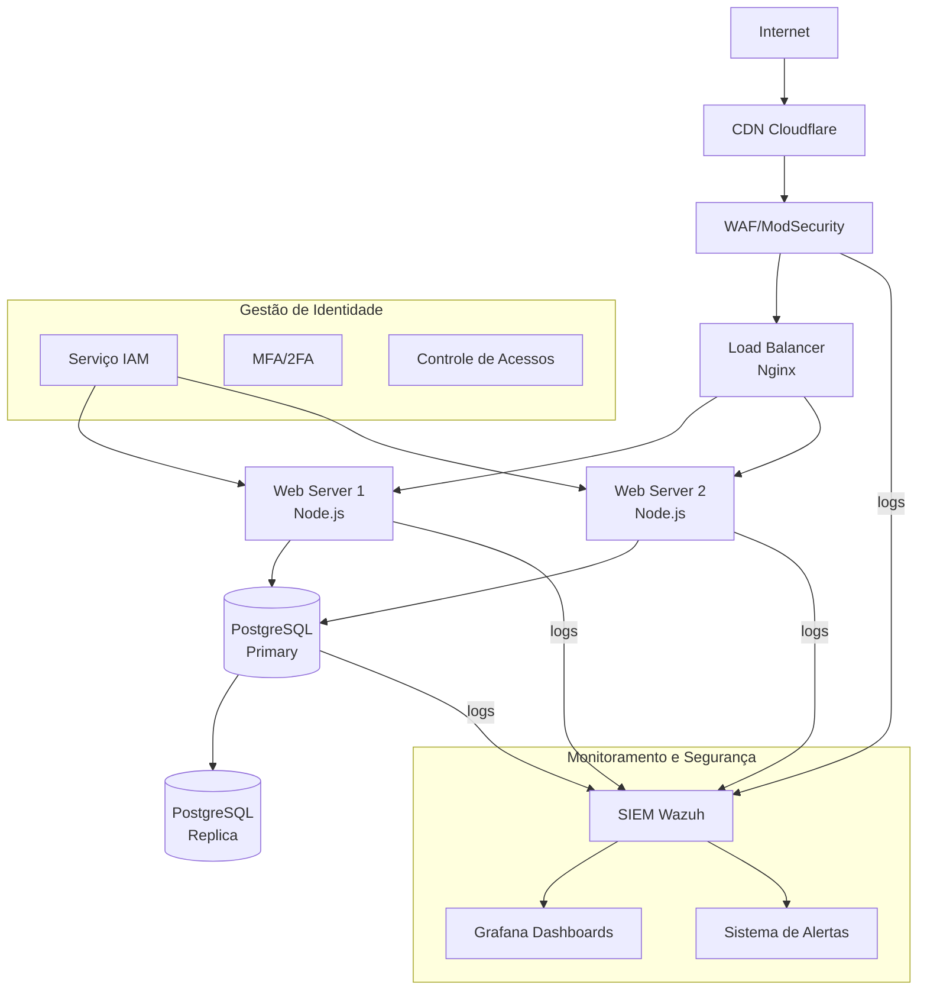

# Diagramas e Arquitetura - Loja Zeta

---

## Diagrama de Arquitetura Principal

### Fluxo de Dados e Proteção

```mermaid
flowchart TB
    Internet[Internet] --> CDN[CDN Cloudflare]
    CDN --> WAF[WAF/ModSecurity]
    WAF --> LB[Load Balancer<br/>Nginx]
    
    LB --> Web1[Web Server 1<br/>Node.js]
    LB --> Web2[Web Server 2<br/>Node.js]
    
    Web1 --> DB[(PostgreSQL<br/>Primary)]
    Web2 --> DB
    DB --> DB_Replica[(PostgreSQL<br/>Replica)]
    
    subgraph Monitoring [Monitoramento e Segurança]
        SIEM[SIEM Wazuh]
        Grafana[Grafana Dashboards]
        Alertas[Sistema de Alertas]
    end
    
    Web1 -->|logs| SIEM
    Web2 -->|logs| SIEM
    DB -->|logs| SIEM
    WAF -->|logs| SIEM
    
    SIEM --> Grafana
    SIEM --> Alertas
    
    subgraph Identity [Gestão de Identidade]
        IAM[Serviço IAM]
        MFA[MFA/2FA]
        RBAC[Controle de Acessos]
    end
    
    IAM --> Web1
    IAM --> Web2
```
---
   

    