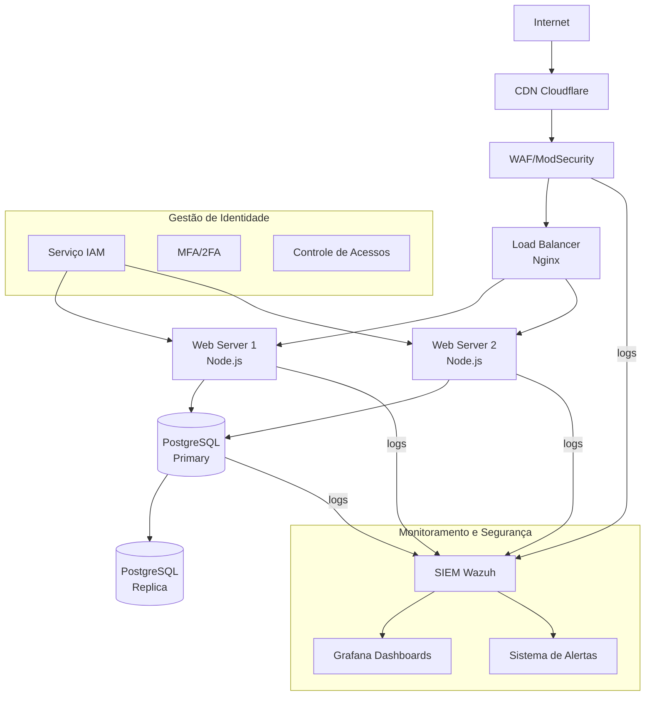
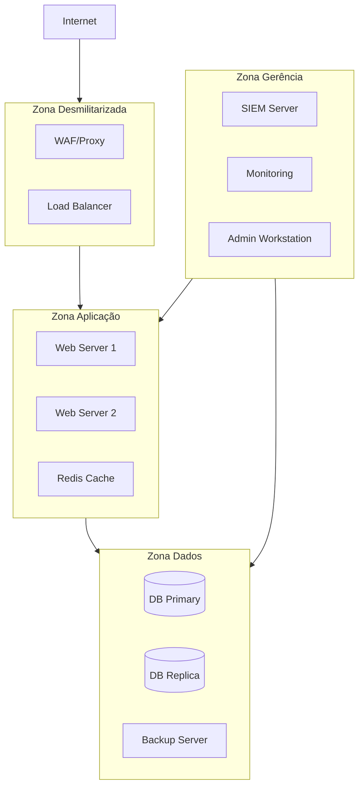
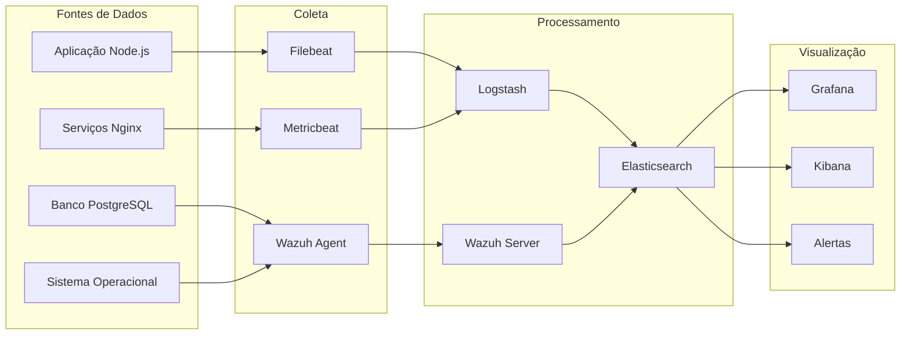
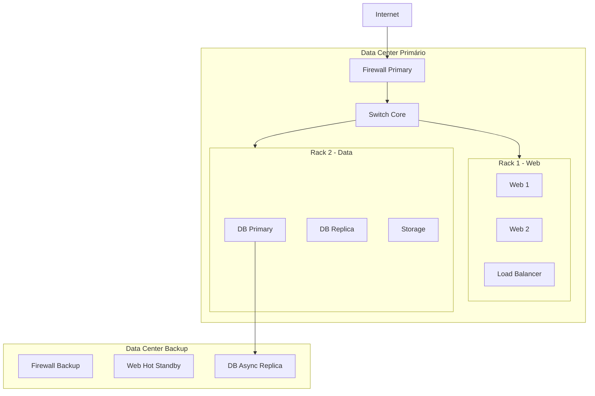

# Diagramas e Arquitetura - Loja Zeta

---

## Diagrama de Arquitetura Principal

# Fluxo de Dados e Proteção

   
## Arquitetura de Rede

# Segmentação e Zonas de segurança

## Diagrama de Monitoramento

# Fluxo de Coleta e Análise

## Topologia Física

# Distribuição de Servidores
